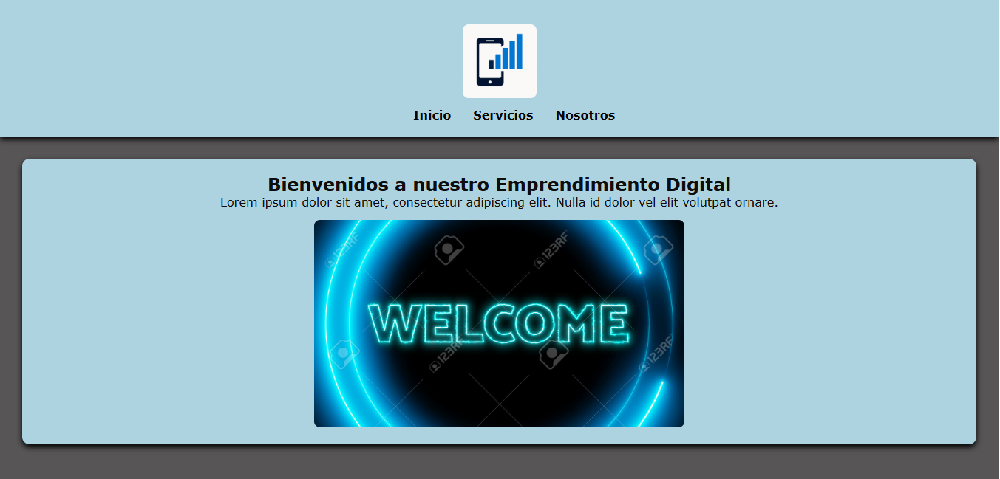
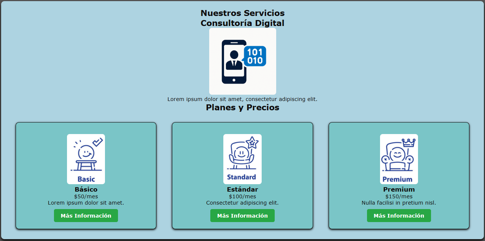
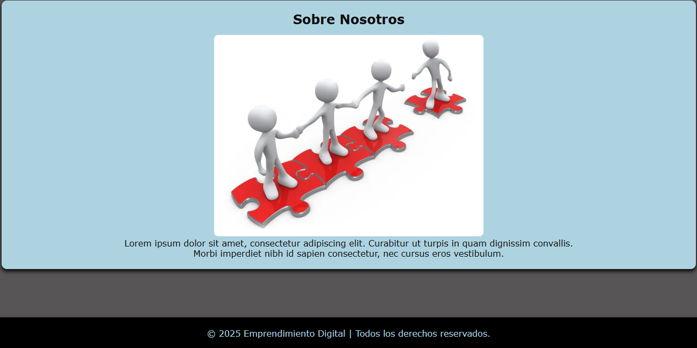
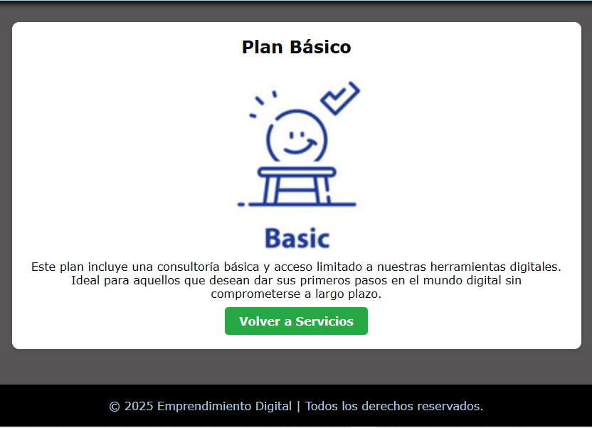
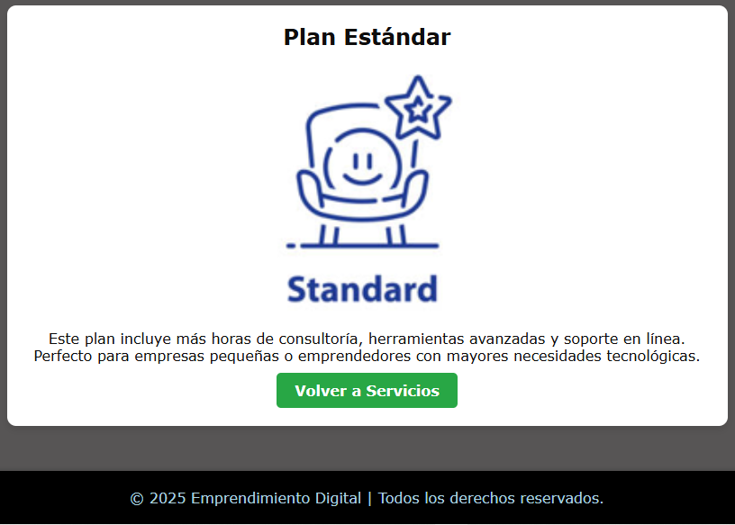
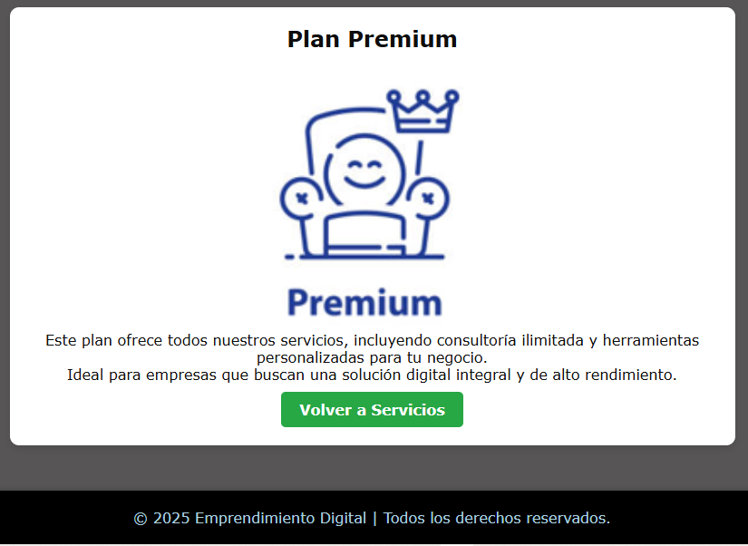

# 🌐 **Emprendimiento Digital** 🚀

## 📝 **Descripción**

El proyecto **Emprendimiento Digital** es un sitio web dedicado a ofrecer servicios de **venta de celulares** y **asesoría en planes móviles**. Ofrecemos tres tipos de planes para satisfacer las necesidades de nuestros clientes:

- **Plan Básico**
- **Plan Estándar**
- **Plan Premium**

A través del sitio, los usuarios pueden explorar las opciones de celulares disponibles y elegir el plan que mejor se adapte a sus necesidades. Además, proporcionamos detalles claros sobre las ventajas de cada plan, ayudando a los clientes a tomar decisiones informadas. El sitio está optimizado para ser accesible desde **cualquier dispositivo**, garantizando una experiencia de usuario fluida y amigable. 💻📱

## 📂 **Estructura de Carpetas y Archivos**

La estructura de archivos de este proyecto es la siguiente:

- **emprendimiento-digital/**
  - `index.html`          - Página principal con información sobre los productos y planes
  - `nosotros.html`       - Página sobre nosotros con la historia de la empresa
  - `servicios.html`      - Página con los servicios ofrecidos (planes y celulares)
  - **css/**               - Carpeta de hojas de estilo
    - `style.css`         - Estilos generales para el sitio
  - **img/**               - Carpeta para imágenes
    - `logo.PNG`              - Imagen del logo
    - `servicio1.PNG`         - Imagen para servicio 1
    - `servicio2.PNG`         - Imagen para servicio 2
    - `basico.PNG`            - Imagen del plan básico
    - `estandar.PNG`          - Imagen del plan estándar
    - `premium.PNG`           - Imagen del plan premium
    - `equipo.PNG`            - Imagen del equipo
  - **pages/**             - Carpeta para planes
    - `plan_basico.html`
    - `plan_estandar.html`
    - `plan_premium.html`
  - `README.md`           - Documento con la descripción del proyecto

## 🚀 **Características Implementadas**

- **Página principal** con información sobre los productos y planes. 🏠
- **Página "Nosotros"** que describe la misión y visión de la empresa. 🏢
- **Página "Servicios"** con detalles sobre los planes de celulares (Básico, Estándar, Premium). 📱
- **Estilos responsivos** para una experiencia de usuario óptima en dispositivos móviles, tabletas y escritorios. 📱💻🖥️

## 📸 **Capturas de Pantalla**

A continuación, puedes ver algunas capturas de pantalla del sitio:

- **Página de inicio**:
  
- **Página de servicios**:
  
- **Página sobre nosotros**:
  
- **Página del plan básico**:
  
- **Página del plan estándar**:
  
- **Página del plan premium**:
  

